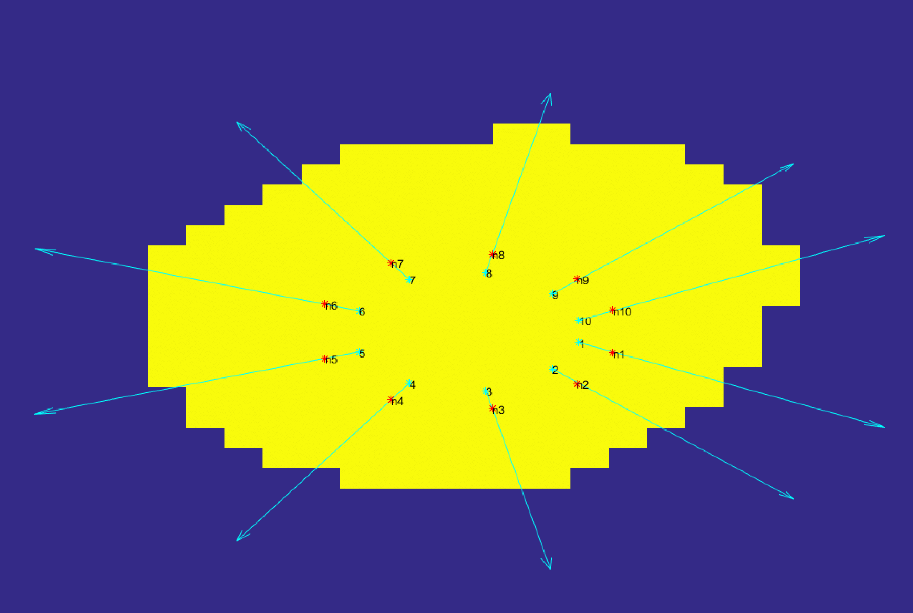
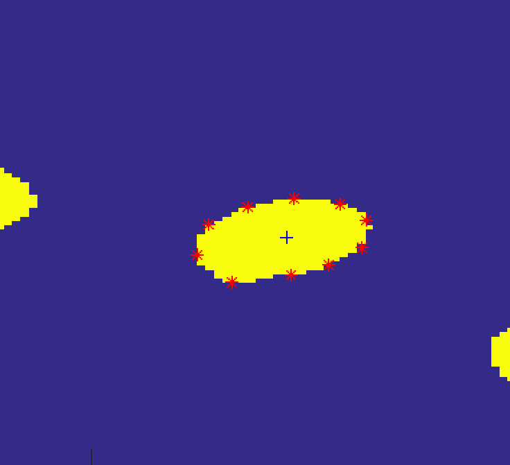
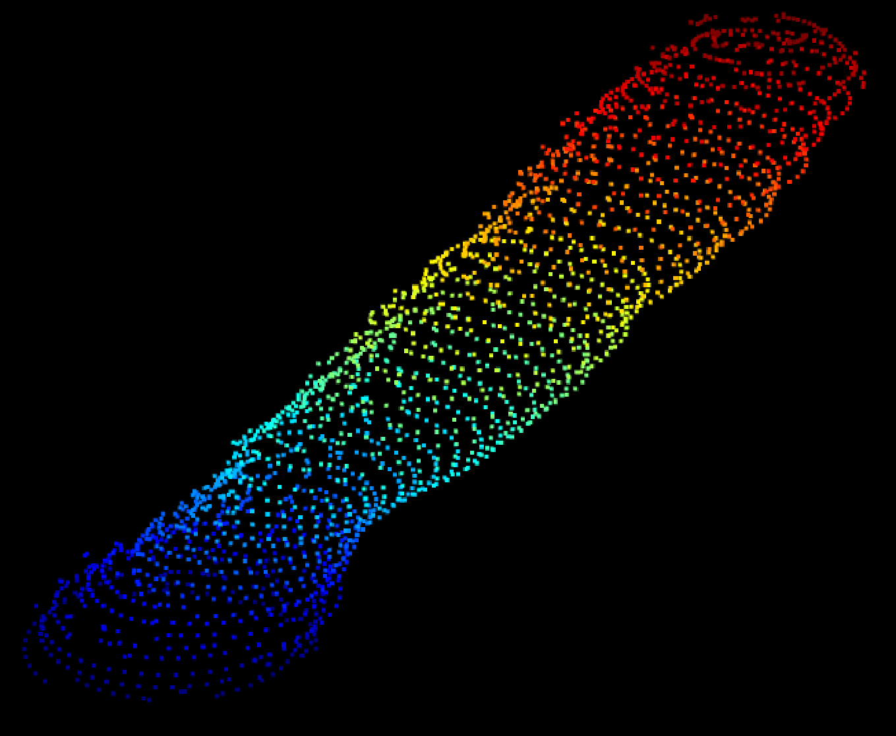

# Volumetric Data Segmentation

## About
MATLAB implementation of the Snake [1] active contour model. We used it to automate the segmentation of the mitochondria structures from the volumetric data of a cell. 

Input data *fib1321.seg.nrrd* is a set of slices of volumetric data - images that contain mitochondria. The user selects the centre of the structure that they want to segment. 
A parametric contour's nodes are generated and affected by a defined inner and outer force so they iteratively conform to the object's shape. 

Afterwards, a new centre is calculated for the next slice and the process repeats itself.

In the end, the program outputs a file containing contour nodes for every slice - a point cloud of a segmented structure. Below is a segmented mitochondrion with 50 nodes per slice.

Several variations of the model were also developed [2, 3]. File porocilo.pdf contains a more detailed report in the Slovenian language. 

Personal assignment project for the Advanced Computer Graphics course at the University of Ljubljana, Faculty of Computer and Information Science.

## Tips
* Parameters of the model can be set with the controlling variables.
* Segmentation is more accurate if the number of contour nodes is set higher. Choosing more than 50 points for provided data has diminishing returns. 
* Segmentation can be manually recalibrated after the desired number of processed slices set with the *everyNchoose* variable.

## Literature
[1] KASS M., WITKIN A., TERZOPOULOS D.: Snakes: Active contour models. International Journal of Computer Vision 1, 4 (Jan 1988), 321–331.

[2] MCINERNEY T., TERZOPOULOS D.: T-snakes: Topology adaptive snakes. Medical Image Analysis 4, 2 (2000), 73–91

[3] GIRALDI G., STRAUSS E., OLIVEIRA A.: Dual-t-snakes model for medical imaging segmentation. Pattern Recogn. Lett. 24, 7 (Apr. 2003), 993–1003
